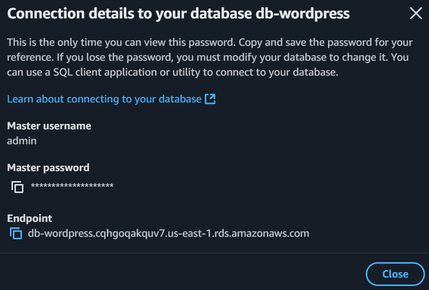

# Projeto_AWS_Docker

## Descrição:

Para realizar o projeto é preciso criar duas instâncias na AWS com um Docker container rodando Wordpress.

## Objetivos: 
- Criar uma VPC (2 sub-redes públicas e 2 sub-redes privadas)
- Configurar os Security Groups
- Criar o Banco de Dados RDS
- Criar o EFS (Elastic File System)
- Criar o Load Balancer
- Criar o ASG (Auto Scaling Group)

## Etapa 1: Criação da VPC

### Procure por VPC, selecione criar VPC e siga as configurações: 
- 2 sub-redes públicas
- 2 sub-redes privadas
- 1 NAT gateway


## Etapa 2: Configuração dos Security Groups

Acesse Security Groups, selecione criar Security Groups e siga as configurações:

> ⚠️ **ATENÇÃO:** Não esqueça de preencher os campos de **Description** e selecionar a **VPC** criada.


### Load Balancer(LB):

#### Inbound Rules:
- HTTP - 0.0.0.0 - All Trafic
- HTTPS - 0.0.0.0 - All Trafic

#### Outbound Rules:
- HTTP - SG-EC2
- HTTPS - SG-EC2

### EC2:

#### Inbound Rules:
- HTTP - SG-LB
- HTTPS - SG-LB

#### Outbound Rules:
- HTTP - SG-LB
- HTTPS - SG-LB
- MYSQL/Aurora - SG-RDS
- NFS - SG-EFS

### Banco de Dados RDS:

#### Inbound Rules:
- MYSQL/Aurora - SG-EC2

#### Outbound Rules:
- MYSQL/Aurora - SG-EC2

### EFS:

#### Inbound Rules:
- NFS - SG-EC2

#### Outbound Rules:
- NFS - SG-EC2

## Etapa 3: Criação do Banco de Dados RDS

Acesse Aurora e RDS, e criar Banco de Dados

### Selecione a Opção do MySQL


### Selecione o Template Gratuito


### Configurações


> ⚠️ **ATENÇÃO:** Não esqueça de alterar o tipo da instância para **db.t3.micro**

### Armazenamento


### Conectividade


### Configurações Adicionais


### Após todas as configurações é criar o Banco de Dados


### Senha:
- Com o Banco de Dados criado, selecione **View Connection Details** para verificar a **Senha** e o **Endpoint**.


- Copie a **Senha** e o **Endpoint**



## Etapa 4: Criação do EFS

Acesse o **EFS** -> **Create File System**

### Preencha o Nome e a VPC criada anteriormente


### Após a criação da EFS, acesse-a e selecione **Network -> Manage**

- Crie dois Mount Target e selecione o Security Group da EFS


### Após criar os pontos de montagem, clique em anexar

- Copie o código:

```
sudo mount -t efs -o tls mount:/ efs
```


