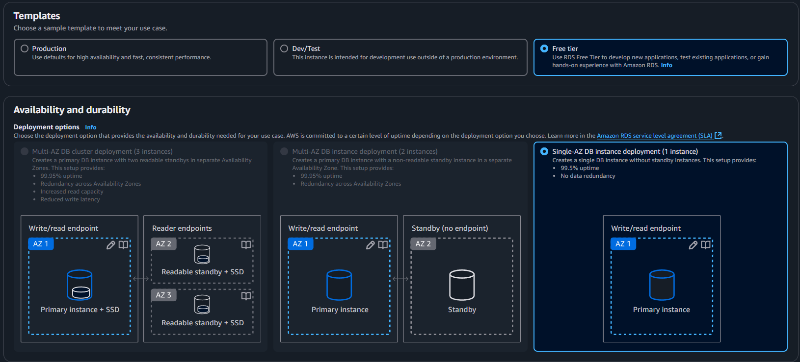
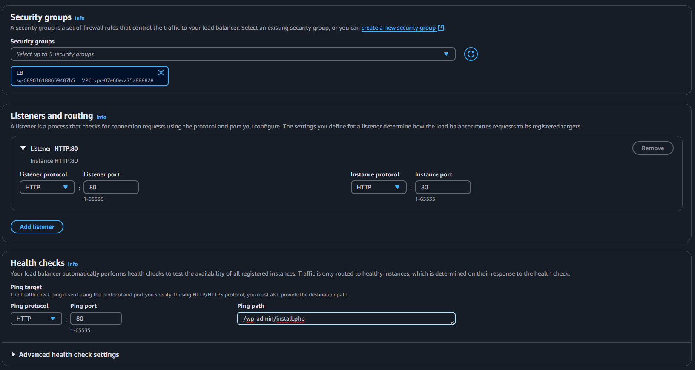
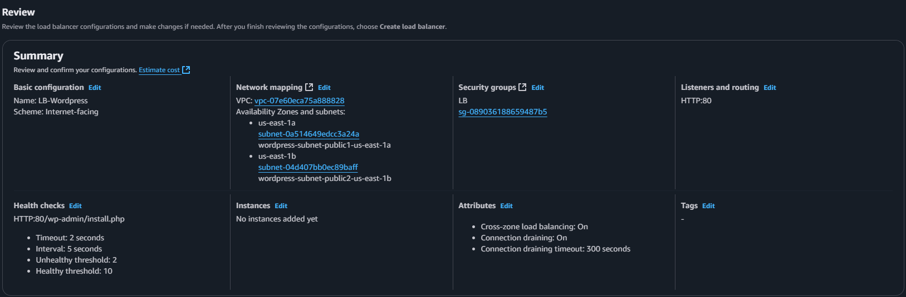

# Projeto_AWS_Docker

## Descrição:

Para realizar o projeto é preciso criar duas instâncias na AWS com um Docker container rodando Wordpress.

## Objetivos: 
- Criar uma VPC (2 sub-redes públicas e 2 sub-redes privadas)
- Configurar os Security Groups
- Criar o Banco de Dados RDS
- Criar o EFS (Elastic File System)
- Criar o Load Balancer
- Criar o ASG (Auto Scaling Group)

## Etapa 1: Criação da VPC

### Procure por VPC, selecione criar VPC e siga as configurações: 
- 2 sub-redes públicas
- 2 sub-redes privadas
- 1 NAT gateway


## Etapa 2: Configuração dos Security Groups

Acesse Security Groups, selecione criar Security Groups e siga as configurações:

> ⚠️ **ATENÇÃO:** Não esqueça de preencher os campos de **Description** e selecionar a **VPC** criada.


### Load Balancer(LB):

#### Inbound Rules:
- HTTP - 0.0.0.0 - All Trafic

#### Outbound Rules:
- HTTP - SG-EC2

### EC2:

#### Inbound Rules:
- HTTP - SG-LB

#### Outbound Rules:
- HTTP - SG-LB
- MYSQL/Aurora - SG-RDS
- NFS - SG-EFS

### Banco de Dados RDS:

#### Inbound Rules:
- MYSQL/Aurora - SG-EC2

#### Outbound Rules:
- MYSQL/Aurora - SG-EC2

### EFS:

#### Inbound Rules:
- NFS - SG-EC2

#### Outbound Rules:
- NFS - SG-EC2

## Etapa 3: Criação do Banco de Dados RDS

Acesse Aurora e RDS, e criar Banco de Dados

### Selecione a Opção do MySQL:


### Selecione o Template Gratuito:



### Digite o nome do usuário do banco, escolha **Self Managed** e **Auto Generate Password** para gerar uma senha


> ⚠️ **ATENÇÃO:** Não esqueça de alterar o tipo da instância para **db.t3.micro**

### Altere o **Maximum storage threshold** para **25**:


### Selecione a VPC e o Security Group do Banco RDS:


### Nas configurações adicionais, digite o nome do banco e desabilite **Enable automated backups**:


### Após todas as configurações é só criar o Banco de Dados:


### Senha:
- Com o Banco de Dados criado, selecione **View Connection Details** para verificar a **Senha** e o **Endpoint**.


- Copie a **Senha** e o **Endpoint**


## Etapa 4: Criação do EFS

Acesse o **EFS** -> **Create File System**

### Preencha o Nome e a VPC criada anteriormente:


### Após a criação da EFS, acesse-a e selecione **Network -> Manage**

- Crie dois Mount Target e selecione o Security Group da EFS


### Após criar os pontos de montagem, clique em anexar:

- Copie o código:

```
sudo mount -t efs -o tls mount:/ efs
```


## Etapa 5: Criação do Load Balancer

Acesse **EC2** -> **Load Balancer** -> **Criar Load Balancer** -> **Classic Load Balancer**


### Escolha um nome e o esquema **Internet-facing**:


### Selecione a VPC criada e as sub-redes públicas:


### Selecione o Security Group criado e altere o caminho de ping:



### Revise e crie o Load Balancer:



## Etapa 5.5: Criação do Script User Data e do Docker-compose

### Crie um repositório no GitHub com dois arquivos:

- userData.sh:
```
#!/bin/bash

sudo yum update -y && sudo yum install ca-certificates wget amazon-efs-utils docker -y 
sudo systemctl enable docker && sudo systemctl start docker
sudo usermod -aG docker ec2-user && newgrp docker

sudo curl -L "https://github.com/docker/compose/releases/latest/download/docker-compose-$(uname -s)-$(uname -m)" -o /usr/local/bin/docker-compose
sudo chmod +x /usr/local/bin/docker-compose && sudo ln -s /usr/local/bin/docker-compose /usr/bin/docker-compose

sudo mkdir -p /efs/data && sudo mount -t efs -o tls <DNS Name>:/ /efs/data

sudo wget -O /home/ec2-user/docker-compose.yml (URL do docker-compose)
sudo chown ec2-user:ec2-user /home/ec2-user/docker-compose.yml

cd /home/ec2-user && docker-compose up -d
```

- docker-compose.yml:
```
services:

  wordpress:
    image: wordpress
    container_name: wordpress
    restart: always
    ports:
      - 80:80
    environment:
      WORDPRESS_DB_HOST: EndpointBanco
      WORDPRESS_DB_USER: usuarioBanco
      WORDPRESS_DB_PASSWORD: senhaDoBanco
      WORDPRESS_DB_NAME: nomeDoBanco
    volumes:
    - enderecoVolume:/var/www/html
```

## Etapa 6: Criação do Launch Template

Acesse **EC2** -> **Launch Template** -> **Criar Launch Template**

### De um nome, uma descrição e selecione **Auto Scaling Guidance**:


### Selecione a imagem **Amazon Linux** e **t2.micro** como tipo de instância:


### Não selecione nenhuma sub-rede e selecione o Security Group da EC2:


### Em detalhes avançados no campo User data, cole o script user data:


### Após isso é só criar o Launch Template